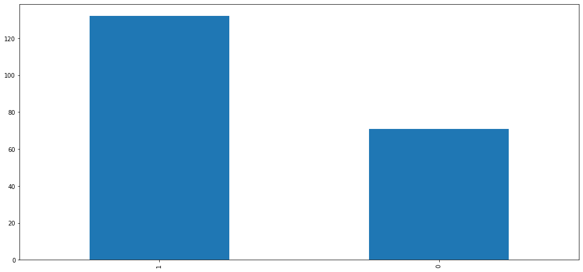
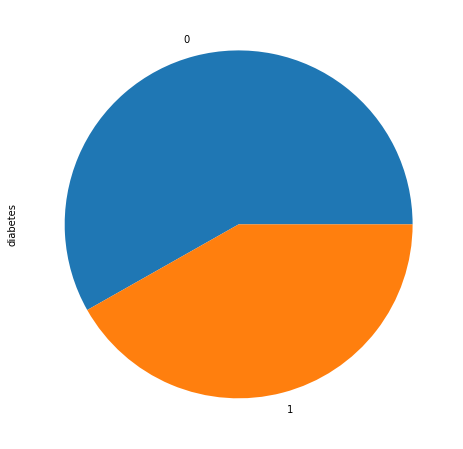
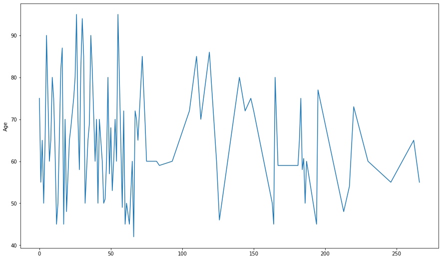

# Data Sience project for Heart Failure Clinical

* Created a web using API Streamit 
* Use the Heart Failure Clinical  records dataset 
* Predict **DEATH EVENT** of any person that user input in
* Give the user the free to choice the agorithms is better
* Controle the accuaray by the parametres 
* Show some different exploration of the data (bar,plot,pie.....)

## Code and Resources Used
**Python Version :** 3.8

**Packages:** pandas, numpy,sklearn,matplotlib,seaborn,streamit,jupyter notebook

**For Web Framework**
**Requirements :** ```pip install -r  requirement.txt```

**Flask Productionization:** 
## Web scraping
Heart Failure Clinical has 299 columns,and  13 rows:
*  Age	
*  Anaemia
*  Creatinine phosphokinase	
*  Diabetes	
*  Ejection fraction
*  High blood  ressure	
*  Platelets	
*  Serum creatinine
*  Serum sodium	
*  Tex	
*  Tmoking	
*  Time
*   DEATH EVENT
## Data Cleaning
After scraping the data, We needed to clean it up to be usable for our model . so I made the following changes :
*  I deleted some columns that isn't important
* I take only 9 columns **Age,Creatinine phosphokinase,Serum creatinine,High blood  ressure,Diabets,Smoking,Death event**
* I split the data to `x` and ``y``
* `x` for all features except **Death event** and `y` for **Death event**
* We drop the null values

## EDA
I do Heatmap exploration to see the relation ship between the columns:
![alt text]C:\Users\mehdi\Desktop\Streamlit Lib\Virtual Envirment\Hart_Failure_clinical_records_Prediction\Exploration_mg)

I plot age to see different age we have:
.png)
also bar char for **Sex** when the deat event is true:


When is False:

Pie chart with diabets columns:


I want to see how age work with Death event:

I try to describe the data ,so I got this below:

count    299.000000

mean      60.833893

std       11.894809

min       40.000000

25%       51.000000

50%       60.000000

75%       70.000000

max       95.000000

Name: age, dtype: float64

## Model Building 
 For the model I bulid it by user input,because like I say ,I give the user the free to choice between  the algorithm and thay parametres setting up.
 I tried 5 different models:
 I use those algorithms because they famouse and the user can now it
 also I use it as classifier,because the label is between *1* and *0*
 *  **Random Forest**
 *  **Support Victore Machine**
 *  **Logistic Regression**
 *  **Desicion Tree**
 *  **Key NieghborS**
## Model performance
We I do test for my application I see the **Random forest** and **SVM** models far outperformed the other.
* **Random forest** : accuracy =1.0 with parametre `max depth` =8,  ``n_estimators``=12
* **SVM** : accuracy =1.0 with parametre `C`=3
## Productionization
I use `streamlit` library,that allows you to build awesome UI for web just with python and a litle of lines .
In this step I build in the web a lot of choice for the user .
He will try to fill the information and well return the prediction of the label(`DEATH_EVENT`) and below there are a lot of buttons of:
* Showing the data
* Column name that you input in
* the button for exploration:
    **Pi** 
    **Plot** 
    **Bar** 
    **Heat map** 
